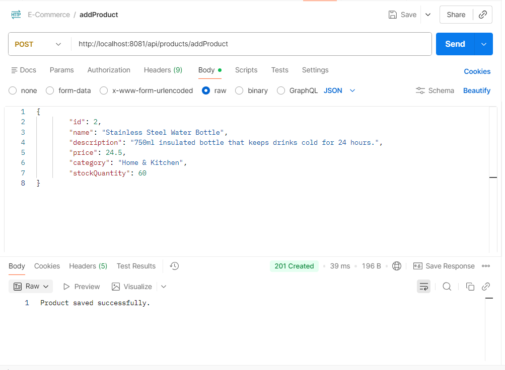
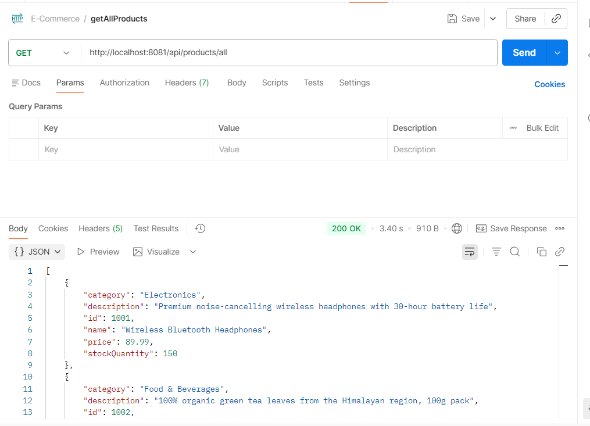
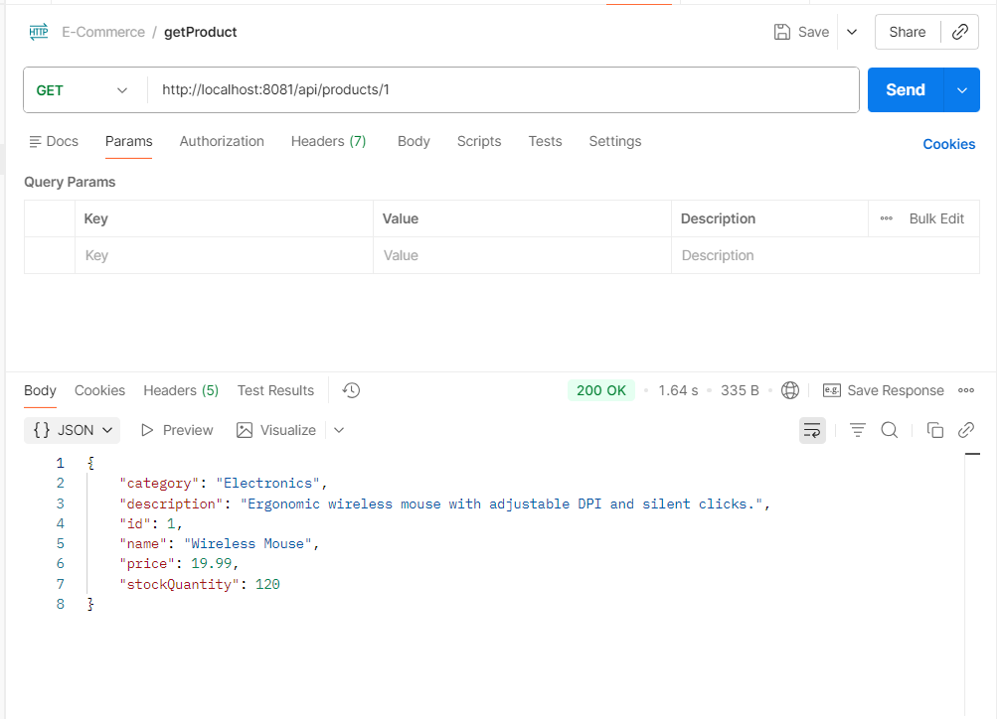
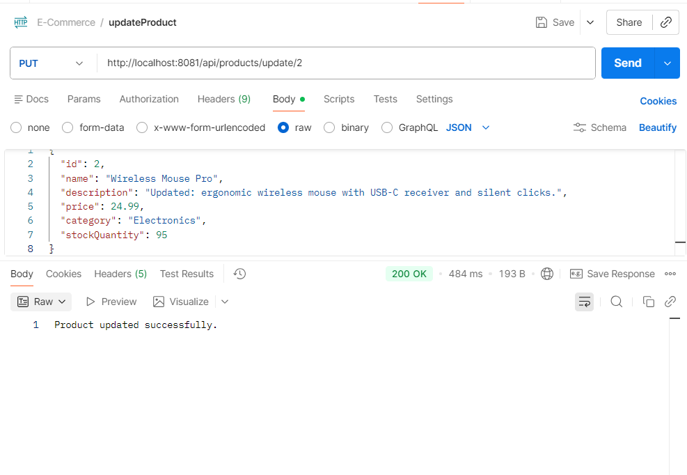
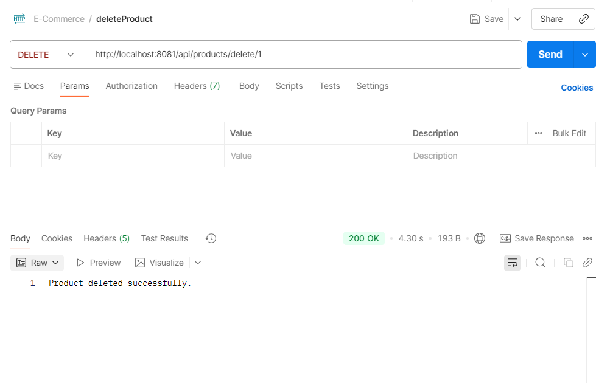
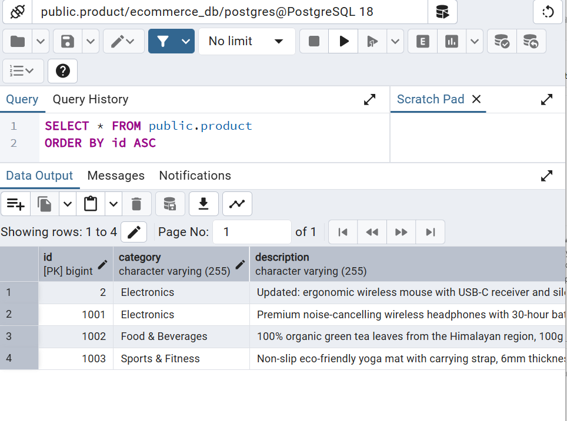

# E-Commerce - CRUD Assignment

This project is a Spring Boot application that implements a complete RESTful API to manage a product inventory stored in a PostgreSQL database.

📝 Project Description

The application provides full CRUD (Create, Read, Update, Delete) functionality for managing products. It uses a layered architecture consisting of Controller, Service, and Repository layers to separate concerns and keep business logic clean and testable.

🚀 Features

- Create: Add new products with details like name, description, price, category, and stock quantity.
- Read: Retrieve a list of all products or fetch a specific product by its unique ID.
- Update: Modify the information of existing products.
- Delete: Remove products from the system using their ID.

🛠️ Technologies Used

- Java 17+
- Spring Boot (Web, Data JPA)
- PostgreSQL (Database)
- Maven (Dependency Management)

⚙️ Configuration

The application runs on port `8081`. Ensure your local PostgreSQL environment is configured as follows (or update `application.properties` accordingly):

- Database: `ecommerce_db`
- Username: `postgres`
- Password: `*****`

Example `application.properties` snippet:

```properties
spring.datasource.url=jdbc:postgresql://localhost:5432/ecommerce_db
spring.datasource.username=postgres
spring.datasource.password=*****
spring.jpa.hibernate.ddl-auto=update
server.port=8081
```

📡 API Endpoints

All endpoints are prefixed with `http://localhost:8081/api/products`.

| Method | Endpoint | Description |
| ------ | -------- | ----------- |
| POST | /addProduct | Creates a new product record. |
| GET  | /all | Retrieves all products from the database. |
| GET  | /{id} | Retrieves a single product by its ID. |
| PUT  | /update/{id} | Updates details for an existing product. |
| DELETE | /delete/{id} | Deletes a product from the database. |

📸 Screenshots

1. Add Product (POST Request)



   - Description: Using Postman to send a JSON body to the `/addProduct` endpoint.

2. View All Products (GET Request)



   - Description: Retrieving the full list of products from the `/all` endpoint.

3. Get Product by ID (GET Request)



   - Description: Fetching details for a specific product using its unique ID.

4. Update Product (PUT Request)



   - Description: Successfully updating a product's price and stock quantity.

5. Delete Product (DELETE Request)



   - Description: Removing a product record and receiving a confirmation message.
  
6. PgAdmin Verification 



   - Description: Confirmation from the pgAdmin that the products are saved.

🏃 How to Run

1. Clone the project repository.
2. Set up the `ecommerce_db` database in PostgreSQL and ensure credentials match `application.properties`.
3. Navigate to the project root and run:

```bash
mvn spring-boot:run
```


